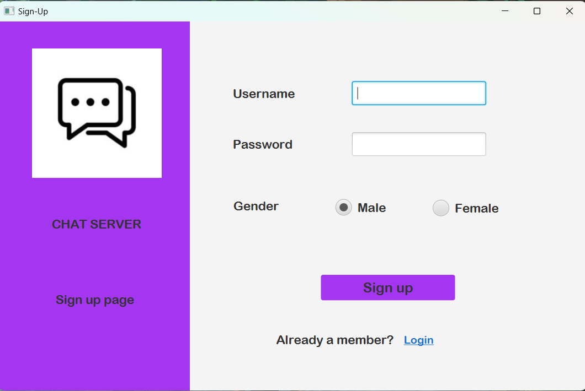
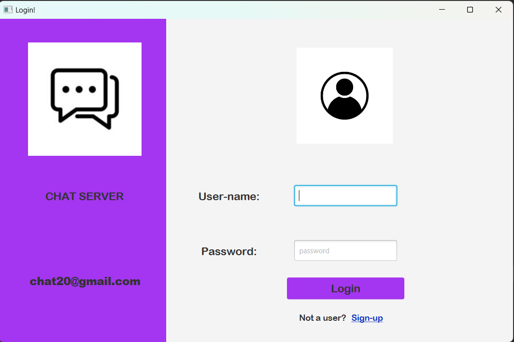
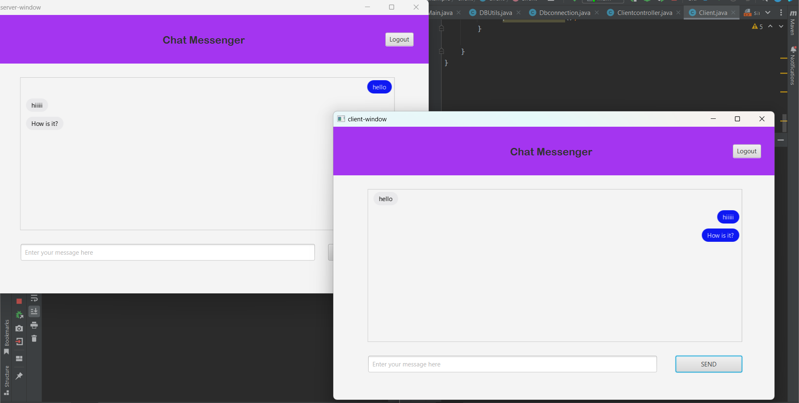

# Java Chat Application

### >Chat application with database connectivity

This is a full java based chat application that stores user details in the database. Authenticates the username and password at time of login and then redirects to chat-window.


\
\


\
\


\
\



\
\
**Requirements:**

1. Both client-master(client) and javalogin(Server) files on the system.

2. Desired Java IDE (IntelliJIDEA / Eclipse/ NetBeans)

3. mysql-connector-jar ( Links: [Jar Link ](https://dev.mysql.com/downloads/connector/j/ "Mysql-jar"))


## Database Connections : 

In MySql create a database with `users` table. Add folloeing attributes:

| username | password | gender |
| --- | --- | --- |
| name | password | male/female |


\
In both javalogin and client-master find `DbConnection.java` inside the path `src\java\com`


```java
public class DbConnection {
    private static final String URL = "jdbc:mysql://localhost:3306/your_database_name";
    private static final String USERNAME = "root";
    private static final String PASSWORD = "you_password";

    public static Connection getConnection() throws SQLException {
        return DriverManager.getConnection(URL, USERNAME, PASSWORD);
    }
}
```

\
Using Xampp server you can use application on two different systems on same internet. For Xampp, change local host to 3307

```java
 private static final String URL = "jdbc:mysql://localhost:3307/users";
```


## Note:
1. Put the  `sql-jar` inside the lib folder and also import it in modules.

2. Run The `Main.java` in both javalogin and client-master.

3. Create users using the signup page and then login with these users.

4. On the Welcome page, firstly click chat-window for server then the client for establishing connection.

5. Type text on the chat window then click `send`.
